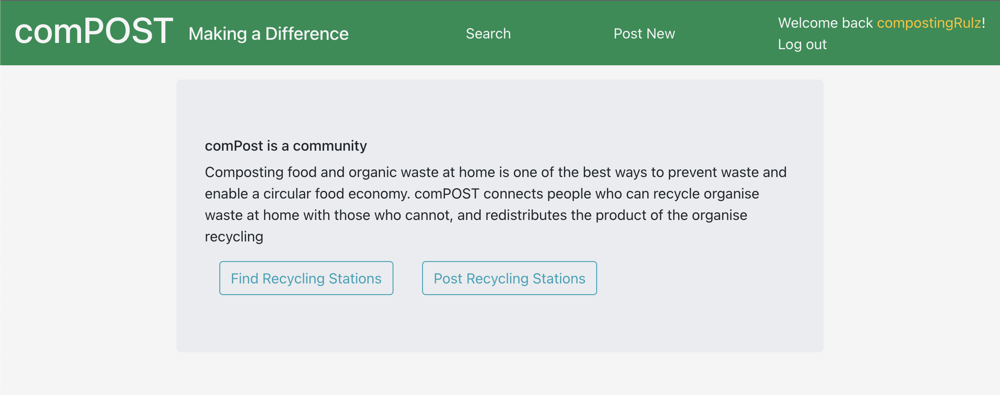

# Project-3: comPOST

## Description

The purpose of this application is to connect people who cannot compost their organic waste with people who can and in-turn connect people with excess amounts of composted soil or organic product with people who have use for it. The application is built as social media with a user rating system based on positive or negative experiences of other users. This application is still in it’s infancy and continues to receive updates and improvements.

## License

[](https://opensource.org/licenses/MIT)

This project is using MIT license.

## Table of Contents

- [User Story](#user-story)
- [Screenshot](#screenshot)
- [Walkthrough Video](#walkthrough-video)
- [Credits](#credits)
- [Heroku deploy](#Deployment)

# User Story

```md
AS an environmentally conscious person
I WANT to recycle and redirect as much of my waste from landfill as possible.
I WANT to help others also avoid having their organic waste end up in landfill.
I WANT a way to redistribute the product of my recycling.
I WANT a way to find and get in contact with other people also participating in this circular economy
```

## Screenshot

How it looks!



## Credits

- ReactJS: https://www.npmjs.com/package/react
- Bootstrap: https://getbootstrap.com/
- NodeJS: https://nodejs.org/en/
- MongoDB:https://www.npmjs.com/package/mongodb
- Mongoose: https://www.npmjs.com/package/mongoose
- Bcrypt: https://www.npmjs.com/package/bcrypt
- Jsonwebtoken (JWT): https://www.npmjs.com/package/jsonwebtoken
- Express.js: https://www.npmjs.com/package/express
- Apollo-server-express: https://www.npmjs.com/package/apollo-server-express
- GraphQl: https://www.npmjs.com/package/graphql

## Deployment

** Note that the application is only seeded with Data for the postcode "2204" for demo purposes. Any other data was added by other users**
[comPost Deployed on Heroku]()
